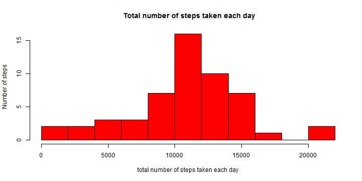
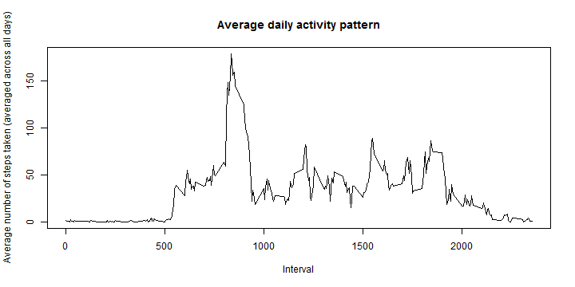
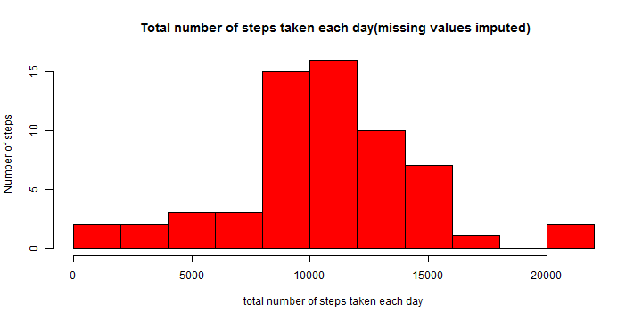
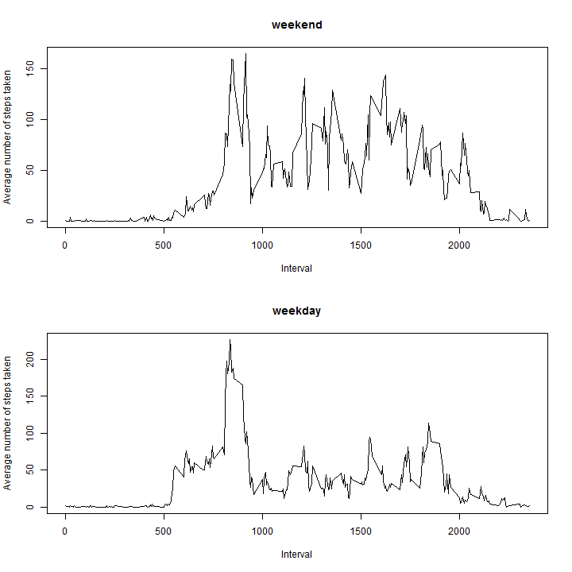

**Answer for Peer Assessment 1**
========================================================

**Step1: Loading and preprocessing the data**


```r
library(plyr)
Sys.setlocale("LC_TIME", "English")
```

```
## [1] "English_United States.1252"
```

```r
data <- read.csv("activity.csv", header = T, na.strings = "NA", sep = ",")
data$date <- as.Date(as.character(data$date), format = "%Y-%m-%d")
```


**Step2: What is mean total number of steps taken per day?**


```r
daydata <- count(data$date)
for (i in 1:nrow(daydata)) {
    sub <- subset(data, data$date == daydata$x[i])
    daydata$steps[i] <- sum(sub$steps, na.rm = F)
}
hist(daydata$steps, col = "red", breaks = 10, main = " Total number of steps taken each day", 
    xlab = "total number of steps taken each day", ylab = "Number of steps")
```

 

```r

print(paste("the mean total number of steps taken per day is", mean(daydata$steps, 
    na.rm = T), sep = " "))
```

```
## [1] "the mean total number of steps taken per day is 10766.1886792453"
```

```r
print(paste("the median total number of steps taken per day is", median(daydata$steps, 
    na.rm = T), sep = " "))
```

```
## [1] "the median total number of steps taken per day is 10765"
```


**Step3: What is the average daily activity pattern?**


```r
intervaldata <- count(data$interval)
for (i in 1:nrow(intervaldata)) {
    sub <- subset(data, data$interval == intervaldata$x[i])
    intervaldata$steps[i] <- sum(sub$steps, na.rm = T)/61
}
plot(intervaldata$x, intervaldata$steps, type = "l", main = "Average daily activity pattern", 
    ylab = "Average number of steps taken (averaged across all days)", xlab = "Interval")
```

 

```r

max <- max(intervaldata$steps, na.rm = F)
print(paste("The 5-minute interval which contains the maximum number of steps on average across all the days in the dataset is", 
    intervaldata$x[which(intervaldata$steps == max)], sep = " "))
```

```
## [1] "The 5-minute interval which contains the maximum number of steps on average across all the days in the dataset is 835"
```


**Step4: Imputing missing values**

The strategy for imputing missing data is to use the the mean for that 5-minute interval.


```r
nasub <- subset(data, is.na(data$steps))
print(paste("the total number of missing values in the dataset is", nrow(nasub), 
    sep = " "))
```

```
## [1] "the total number of missing values in the dataset is 2304"
```

```r
newdata <- data
for (i in 1:nrow(newdata)) {
    if (is.na(newdata$steps[i])) {
        newdata$steps[i] <- intervaldata$steps[which(intervaldata$x == newdata$interval[i])]
    }
}
newdaydata <- count(newdata$date)
for (i in 1:nrow(newdaydata)) {
    sub <- subset(newdata, newdata$date == newdaydata$x[i])
    newdaydata$steps[i] <- sum(sub$steps)
}
hist(newdaydata$steps, col = "red", breaks = 10, main = " Total number of steps taken each day(missing values imputed)", 
    xlab = "total number of steps taken each day", ylab = "Number of steps")
```

 

```r

print(paste("the mean total number of steps taken per day is", mean(newdaydata$steps), 
    sep = " "))
```

```
## [1] "the mean total number of steps taken per day is 10581.013705993"
```

```r
print(paste("the median total number of steps taken per day is", median(newdaydata$steps), 
    sep = " "))
```

```
## [1] "the median total number of steps taken per day is 10395"
```


These values differ from the estimates from the first part of the assignment, the mean and median numbers of steps taken per day in this are less than the mean and median in step2.

**Step5: Are there differences in activity patterns between weekdays and weekends?**


```r
for (i in 1:nrow(newdata)) {
    newdata$weekday[i] <- weekdays(newdata$date[i])
}
newdataweekday <- subset(newdata, (newdata$weekday == "Monday" | newdata$weekday == 
    "Tuesday" | newdata$weekday == "Wednesday" | newdata$weekday == "Thursday" | 
    newdata$weekday == "Friday"))
newdataweekend <- subset(newdata, (newdata$weekday == "Saturday" | newdata$weekday == 
    "Sunday"))
intervaldataweekday <- count(newdata$interval)
intervaldataweekend <- count(newdata$interval)
for (i in 1:nrow(intervaldataweekday)) {
    sub1 <- subset(newdataweekday, newdataweekday$interval == intervaldataweekday$x[i])
    sub2 <- subset(newdataweekend, newdataweekend$interval == intervaldataweekend$x[i])
    intervaldataweekday$steps[i] <- sum(sub1$steps, na.rm = T)/nrow(sub1)
    intervaldataweekend$steps[i] <- sum(sub2$steps, na.rm = T)/nrow(sub2)
}
par(mfcol = c(2, 1))
plot(intervaldataweekend$x, intervaldataweekend$steps, type = "l", main = "weekend", 
    ylab = "Average number of steps taken", xlab = "Interval")
plot(intervaldataweekday$x, intervaldataweekday$steps, type = "l", main = "weekday", 
    ylab = "Average number of steps taken", xlab = "Interval")
```

 

